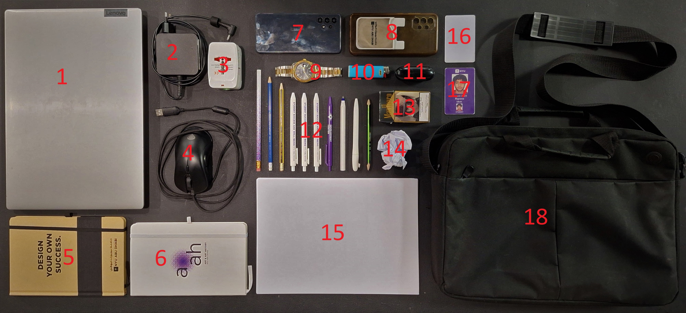

# Manus et Machina Assignment 1

## What's in my bag?

1. **Laptop** - My personal laptop. Although it is quite heavy it is an essential, and I personnaly would not compromise on size. _Of the screen of course, what did you think?_

1. **Laptop Charger** - Charger for my laptop. It is also quite big and has an european plug, both of which regularly become a hassle to deal with.

1. **Universal Adapter** - Adapter exclusively for my laptop charger. _"From any port to any socket" - someone probably._

1. **Mouse** - Mouse for my laptop. It fits comfortably in my hand and is not too fancy, although I rarely use it nowadays.

1. **Notebook 1** - Notebook to jot down notes in class. Currently used for Ordinary Differential Equations and Advanced Circuits.

1. **Notebook 2** - Another notebook to jot down notes in class. Currently used for Static Program Analysis and Conservation Laws in Engineering.

1. **Phone** - My phone. I've had it for years and it has not disappointed. The screen is lighly cracked and the volume buttons get stuck sometimes, but overall in pretty good condition. Oh, and its an android, Iphones confuse me.

1. **Phone Case** - Trusty phone case, with an attachment to keep my cards. _Protecting your phones since 1996._

1. **Watch** - A watch my grandma gifted me. I don't wear it everyday but it is a staple accessory.

1. **Lighter** - A sparkwheel lighter. Has a bright color, and that's probably the only thing I like about it.

1. **Earbuds** - My bluetooth earbuds. I've had them for a better half of a decade and it shows, they are literaly falling apart fighting for their life. One of the buds still works though somehow.

1. **Pens/Pencils** - An assortment of pens and pencils. Mostly gotten from different events and chucked them in the bag. _One doesn't work? No worries! I have like 95 more!!_

1. **Cigarettes** - My pack of cigarettes. Marlboro Black Gold. Not too strong, and quite smooth. If I had to pick my favourite brand it would probably be this. _Yes I smoke. We listen and we don't judge._

1. **Trash** - Random trash that somehow accumulates in my bag, which I regularly clean out in batches. Mostly crunched up paper. _We. Listen. And. We. Don't. Judge._

1. **Paper** - A giant pile of spare sheets of paper. You never know when you might need it.

1. **Room Card** - My room card, The key to my dorm, and the sole reason why I got the card holder on my phone. I've been locked out too many times to count.

1. **NYU ID** - My NYU ID. It hold on campus identity, and (fake) money

1. **Bag** - And last but certainly not least, my trusty bag, which holds most of these items everyday. It's the perfect size for my laptop and still has plenty of space to spare. Has a very convenient handles and a shoulder strap. _Which isn't helping my scoliosis at all._

### [back](./)